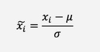

# intro_machine_learning

### Algoritmos de Machine Learning
- Aprendizaje supervisado
El modelo obtiene features de entrada y salida. hay un target/objetivo a predecir
* Regresión (Regresión Lineal)
Target output (objetivo de salida) es numerico
Ejemplos: Advertising popularity prediction, Estimación de la esperanza de vida, Pronósticos de temperatura
Pronósticos de mercado
* Clasificación (Regresión Logística, Random Forest)
Target output que es una etiqueta
Ejemplos: Clasificación de imagenes, Retención de clientes, Diagnósticos, Detección de fraude de identidad

- Aprendizaje no supervisado
Objetivo desconocido, queremos encontrar estructura y grupos dentro de los datos
* Clustering (k-means, Hierarchical clustering)
Queremos encontrar grupos en los datos
Ejemplos: Sistemas de recomendación, Segmentación de clientes, Marketing dirigido
* Dimensionality reduction (T-SNE, PCA)
Queremos encontrar que features de entrada en los datos son de ayuda
Ejemplos: Comprensión significativa, Visualización de Big Data

Receta de algortimos ML
1. Proceso de decisión: cómo los modelos hacen una predicción, o retornan una respuesta, usando los parámetros
2. Función de error/coste: cómo evaluar si los parámetros en el modelo generan buenas predicciones
3. Regla de actualización: cómo mejorar los parámetros para hacer mejores predicciones (usando optimización numérica)

Normalizar tus datos numéricos (estabilidad numérica) es una práctica común - no siempre es necesario

Te aseguras que los modelos no tienen problemas de estabilidad numérica, cambiamos la escala que es el tamaño
de los valores, normalizar los datos numéricos regularmente permitirá que el modelo vea los valores en un 
contexto muy similar

Para cada columna del dataset con valores numéricos:
1. Calcular el promedio de tus datos (miu)
2. Calcular la desviación estándar (tetha) de tus datos 
3. Para cada punto de datos, realizar:

Prepara los datos para los modelos
* Training (60-80%) datos de los que el modelo aprende patrones
* Validation (0-20%) datos que usas para verificar que el modelo aprende
* Testing (0-20%) datos que se apartan para revisar si el modelo fue exitoso al predecir